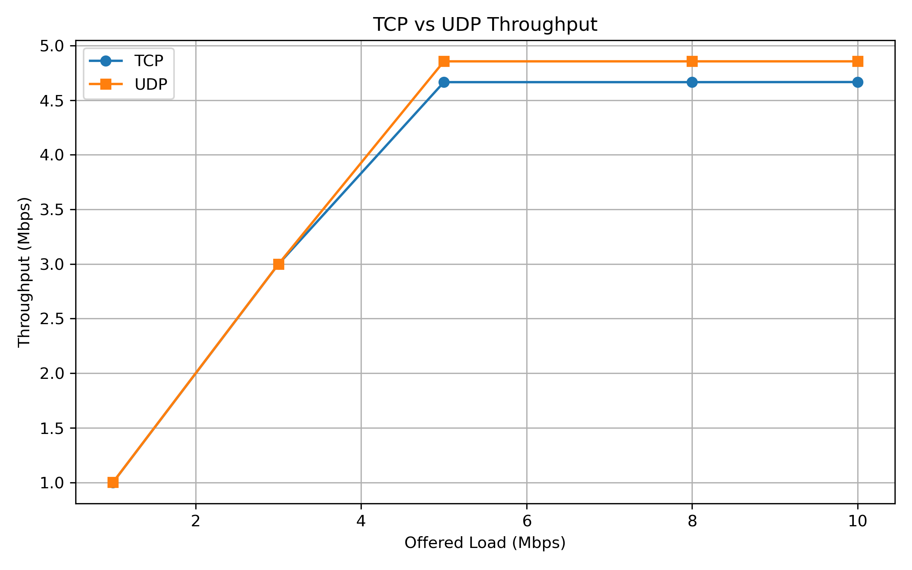

# TCP vs UDP: Congestion & Performance Analysis

An NS-3 based experimental study of **TCP and UDP behavior under increasing network load**, focusing on throughput, packet loss, and delay.

The project uses a controlled point-to-point network with a **5 Mbps bottleneck link** and evaluates traffic loads from **1 Mbps to 10 Mbps**. The objective is to observe how transport-layer performance changes as offered load approaches and exceeds network capacity.

## Throughput Comparison



## Key Metrics

- TCP and UDP throughput
- UDP packet loss
- End-to-end delay
- Performance under increasing offered load
- Effects of congestion and bottleneck capacity

## Technologies

**NS-3 · C++ · Python · Matplotlib · Linux**

## Project Structure

```text
tcp-udp-congestion-analysis/
├── simulations/    # NS-3 simulation programs
├── scripts/        # Experiment and analysis scripts
├── results/        # Simulation data and figures
├── docs/           # Methodology and findings
└── README.md
